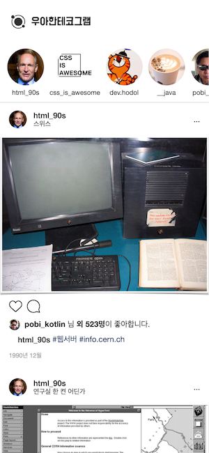

## 🚀 미션: 90년생 HTML 소개하기

## [우아한테코그램](https://woonjangahn.github.io/html)

  

 

### 주요 기능

- [x] Instagram 디자인을 참고하여 HTML을 소개하는 페이지를 작성
- [x] `assets/javascript/data`에 내용을 추가하면 바로 반영되도록 템플릿화 (`friends`, `posts`)
- [x] Scrollable한 친구들 목록
- [x] 좋아요 기능 (버튼 토글, 좋아요 숫자 변화)
- [x] 댓글 기능 (버튼 토글, 댓글 작성 및 상태 업데이트)
- [ ] **(to-do)** 더보기 기능
- [ ] **(to-do)** 해시태그 기능
- [ ] **(to-do)** 날짜순 정렬 (현재는 post data의 index 기준으로 하드코딩)

## 사용한 태그들과 기능들

- ``: 이미지를 가져오는 태그로, `src` 속성에 이미지의 소스 주소를 넣어야 하고, `alt` 속성에 접근성을 위한 이미지의 설명을 첨부해야 한다. 
- `<input>`: 사용자 입력에 관련된 태그로, `type`에 따라 `text`, `number`, `date` 등 다양한 입력을 받을 수 있다.
- `<button>`: 사용자가 누를 수 있는 버튼 태그로, `form`에서는 `<input type="button>`과 같이 사용하지만 그냥 명시적으로 버튼임을 알려줄 수 있다. 
- `<small>`: 작은 글 (주석 등)을 명시적으로 나타낼 때 사용한다.
- `<svg>`: Scalable Vector Graphic의 약자로, 벡터 이미지를 만드는 코드이다.
- `<nav>`: Semantic Elements로, 메뉴가 들어가는 네비게이션 바를 명시적으로 나타낸다.
- `<header>`: Semantic Elements로, 헤더를 명시적으로 나타낸다.
- `<section>`: Semantic Elements로, 글 또는 페이지의 부분을 분리할 때 사용한다.
- `<main>`: Semantic Elements로, 문서의 주요한 내용을 담는 요소이다.
- `<article>`: Semantic Elements로, 블로그 포스트 등 문서와 페이지와 독립적으로 구성할 수 있는 요소이다.

## 요구사항 

- [x]  `<html>` `<head>` `<title>`  `<body>` 태그를 반드시 포함한다. 
- [x]  `<head>` 태그 안에는 `<meta charset="utf-8">` 를 삽입한다.
- [x]  위 5개의 태그를 제외하고 최소 10개 이상의 태그를 이용한다.
- [x]  1개 이상의 이미지 또는 비디오를 삽입한다.
- [x]  댓글을 작성하는 `input` 또는 `textarea` 태그를 사용한다. (실제 동작할 필요는 없음)
- [x]  자신이 사용한 태그들의 기능을 README.md에 작성한다.
